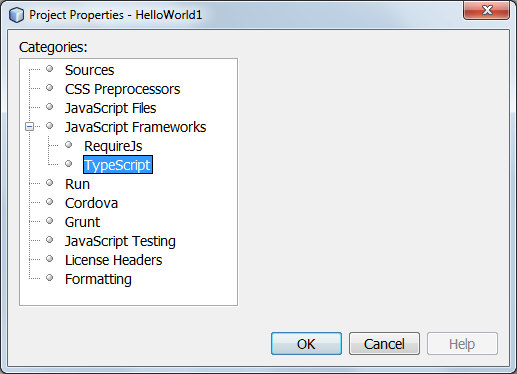
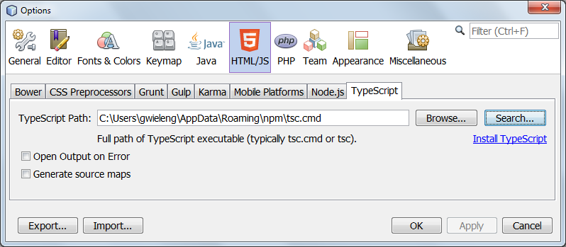
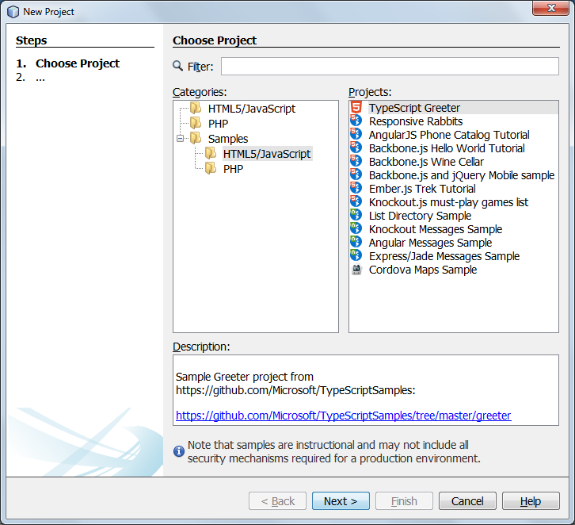
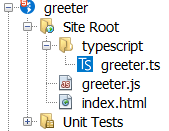
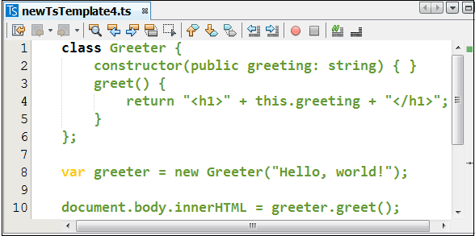

# TypeScript

## Specification for NetBeans Support for TypeScript

A basic outline of features that are needed in order in which they are needed.

All screenshots shown below are taken from the current state of this repo.

### Phase 1: Set up the GUI infrastructure

#### (a) Extension to Project Properties dialog

Similar to support for SASS and LESS, here the user will
specify the folders in which TS files will be found
and the matching folders where the JS should be generated.

#### (b) Extension to Options window

Similar to support for SASS and LESS, here the user will
define the settings related to the TSC tool that will be
used to generate the JS from the TS.

### Phase 2: Generate JavaScript from TS on Save

Use tsc --sourcemap greeter.ts

Using the settings returned from the GUI defined in Phase 1,
automatically generate JS for the currently changed TS file.

### Phase 3: TypeScript Code Structures

#### (a) Code Templates for TypeScript

to be done

#### (b) File Templates for TypeScript

to be done

#### (c) Project Templates for TypeScript

### Phase 4: TypeScript Editor

#### (a) New File Type for TypeScript

Phase 2 above assumes there is support for the TS file extension,
i.e., TS files should be recognized and when there is a change,
the JS should be generated.

#### (b) Sytax Coloring for TypeScript

A start has been made, as can be seen above.

#### (c) Code Completion for TypeScript

to be done

#### (d) Refactoring for TypeScript

to be done

### Phase 5: TypeScript Debugger

to be done

